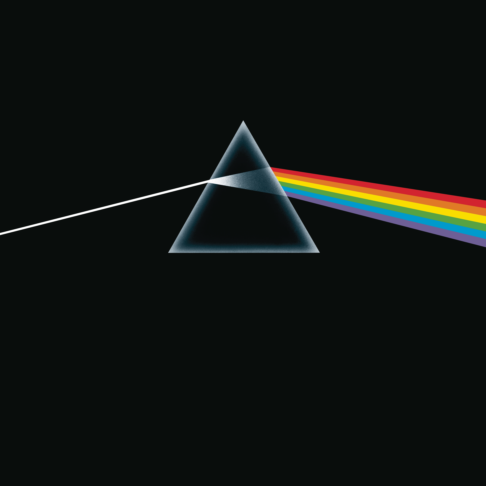

# The Dark Side of the Moon



A Neovim colorscheme inspired by the palette of Pink Floyd's *The Dark Side of the Moon*, with dark and light variants.

## Requirements

- Neovim 0.8 or newer
- `termguicolors` enabled for the intended colors

## Installation

### lazy.nvim

```lua
{
  "ttusk/colorscheme.tdsotm",
  lazy = false,
  priority = 1000,
  config = function()
    vim.opt.termguicolors = true
    vim.opt.background = "dark"
    vim.cmd.colorscheme("tdsotm")
  end,
}
```

### packer.nvim

```lua
use({
  "ttusk/colorscheme.tdsotm",
  config = function()
    vim.opt.termguicolors = true
    vim.opt.background = "dark"
    vim.cmd.colorscheme("tdsotm")
  end,
})
```

### vim-plug

```vim
Plug 'ttusk/colorscheme.tdsotm'
```

Then select the theme in `init.lua`:

```lua
vim.opt.termguicolors = true
vim.opt.background = "dark"
vim.cmd.colorscheme("tdsotm")
```

Plugin managers can install this repository directly; no build step is required.

## Other themes

Matching templates for the rest of the terminal workflow live under `themes/`:

- Ghostty: copy `themes/ghostty/tdsotm-dark` and `tdsotm-light` to `~/.config/ghostty/themes/`.
- Yazi: copy the two `themes/yazi/` flavor directories to `~/.config/yazi/flavors/`.
- Starship: use the matching file in `themes/starship/` as `STARSHIP_CONFIG`.
- Oh My Pi: copy the JSON files in `themes/oh-my-pi/` to `~/.omp/agent/themes/`.
- tmux: source `themes/tmux/tdsotm.conf` from your tmux configuration.

Dark and light variants use the same semantic palette across every target.

## Variants

Use `vim.opt.background = "dark"` for the dark variant or `"light"` for the light variant before loading the colorscheme:

```lua
vim.opt.background = "light"
vim.cmd.colorscheme("tdsotm")
```

## License

The theme source code is available under the MIT License. The preview artwork in `public/` is retained for presentation and is not covered by that license; its underlying rights belong to its respective copyright holder. Pink Floyd and *The Dark Side of the Moon* are not affiliated with or endorsing this project.
